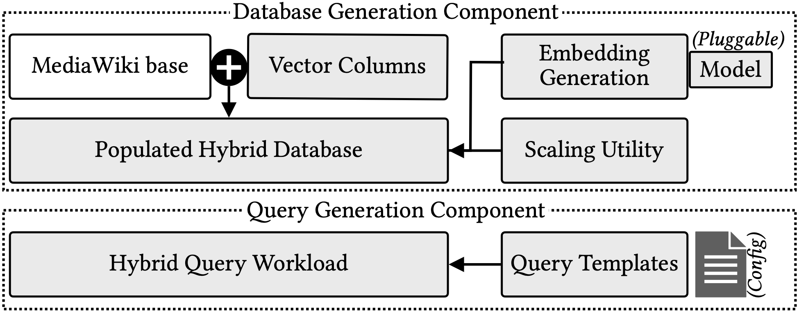

<div align="center">

# RVBench

### Benchmarking Hybrid Relational-Vector Database Systems

[](#requirements)
[](#requirements)
[](#requirements)
[](#benchmark-workload)
[](https://iitd-data-systems.github.io/RVBench/)

**RVBench** is a benchmark framework for evaluating database systems that execute **hybrid queries**: queries that combine classic relational operators such as filters, joins, grouping, and aggregation with vector similarity search.

[Overview](#what-is-rvbench) | [Features](#key-features) | [Quick Start](#quick-start) | [Workload](#benchmark-workload) | [Citation](#citation)

</div>

---

## What is RVBench?

Modern AI applications rarely need vector search alone. They usually need vector search together with structured database operations:

- Find Wikipedia pages semantically similar to a query, but only if their metadata satisfies a filter.
- Retrieve similar revisions within a timestamp range.
- Join semantic search results with revision/category tables.
- Group, aggregate, and analyze similarity results by structured attributes.
- Explore not only the nearest items, but also rank intervals and sampled similarity ranks.

**RVBench** turns these patterns into a reproducible benchmark. It adapts the real-world **MediaWiki** relational schema, adds vector columns for textual attributes, generates parameterized hybrid SQL workloads, and provides a C++ reference implementation for evaluating latency and result quality across vector indexes and database systems.

<p align="center">
  
</p>

---

## Key Features

| Feature | What RVBench provides |
|---|---|
| Real relational-vector schema | MediaWiki-derived `Page`, `Text`, `Revision`, and `CategoryLinks` tables with vector embeddings on textual attributes. |
| Hybrid SQL workload | 39 parameterized query templates that interleave vector similarity with filters, joins, group-by, aggregation, CTEs, subqueries, and set operations. |
| Multiple similarity semantics | Supports nearest-neighbor, rank-interval, and sampled-neighbor workloads. |
| Pluggable embeddings | Generate embeddings with Hugging Face Transformers or custom embedding models. |
| Scalable generation | Sample datasets of different sizes and evaluate different embedding dimensions. |
| Reference implementation | C++17 baseline with HNSW/IVF-style ANN execution using FAISS/HNSWlib support. |
| Accuracy evaluation | Compare approximate outputs against ground truth with precision and RMSE-based metrics. |
| Reproducible outputs | Includes raw results, execution outputs, pgvector plans, and analysis scripts. |

---

## Repository Layout

```text
RVBench/
├── baseline-implementation/      # C++ reference/baseline query executor
│   └── queries/                  # Implementations for the benchmark queries
├── database-generation/          # Dataset, embedding, index, and offset generation
│   ├── data_csv_files/           # MediaWiki-derived CSV inputs
│   ├── index_files/              # HNSWlib/FAISS index generation code
│   └── offsets_files/            # Offset files for fast line access
├── output-files/                 # Experimental outputs and accuracy tools
├── query-generation/             # Generated query instances
└── query-templates/              # SQL templates for all benchmark queries
```

---

## Requirements

RVBench is intended for Linux-like environments with C++ and Python tooling.

### Core dependencies

- C++17 compiler with OpenMP support, such as GCC or Clang
- Python 3.8+ recommended
- FAISS, including `libfaiss.a`
- OpenBLAS
- HNSWlib for C++
- Hugging Face `transformers` for embedding generation

### Optional dependencies

- PostgreSQL with `pgvector`, if you want to recompute ground truth results
- Python packages such as `numpy`, `pandas`, `torch`, `transformers`, `psycopg2`, and `openpyxl`

> Note: Several scripts contain local library paths for FAISS/OpenBLAS. Update those paths before running the build scripts on your machine.

---

## Quick Start

### 1. Clone the repository

```bash
git clone https://github.com/IITD-data-systems/RVBench.git
cd RVBench
```

### 2. Prepare Python dependencies

If the repository has a `requirements.txt`, use it:

```bash
python3 -m venv .venv
source .venv/bin/activate
pip install --upgrade pip
pip install -r requirements.txt
```

Otherwise, install the common dependencies manually:

```bash
python3 -m venv .venv
source .venv/bin/activate
pip install --upgrade pip
pip install numpy pandas torch transformers sentence-transformers psycopg2-binary openpyxl
```

### 3. Prepare the MediaWiki CSV files

Place the input CSV files under `database-generation/data_csv_files/` using the expected structure:

```text
database-generation/data_csv_files/
├── category_csv_files/
│   └── category_links_clean.csv      # cl_from, cl_to
├── page_csv_files/
│   ├── page.csv                      # page_id, page_title
│   ├── page_extra.csv                # page_len, page_touched, page_namespace
│   └── embedding.csv                 # generated page-title embeddings
├── revision_csv_files/
│   └── revision_clean.csv            # rev_id, rev_page, rev_minor_edit, rev_actor, rev_timestamp
└── text_csv_files/
    ├── text.csv                      # old_id, old_text
    └── embedding.csv                 # generated text embeddings
```

The embedding files should follow the same row order as their corresponding table files.

### 4. Configure FAISS/OpenBLAS paths

Before generation or execution, open these scripts and update system-specific library paths:

```text
database-generation/database_and_query_generator.sh
baseline-implementation/queries/run.sh
```

Look for compile commands that link FAISS, OpenBLAS, OpenMP, or HNSWlib and edit the include/library paths for your installation.

### 5. Generate database artifacts and benchmark queries

```bash
cd database-generation
bash database_and_query_generator.sh
```

This script generates embeddings, query files, indexes, and offset files used by the baseline implementation.

### 6. Run the baseline benchmark

```bash
cd ../baseline-implementation/queries
bash run.sh
```

This compiles and runs the benchmark queries across the configured index and metric combinations.

### 7. Evaluate accuracy

```bash
cd ../../output-files
bash accuracy_baseline.sh
```

Accuracy is computed by comparing baseline outputs with ground truth result files. If you change the embedding model, dataset scale, or query settings, recompute the ground truth first.

---

## Sampling a Smaller Dataset

To create a smaller dataset from the original MediaWiki-derived dataset:

```bash
cd database-generation
python3 sampling.py <rows_in_page_table>
```

Example:

```bash
python3 sampling.py 500000
```

`<rows_in_page_table>` must be smaller than the number of rows in the original `page.csv` file.

---

## Benchmark Workload

RVBench organizes hybrid workloads into three similarity families.

### 1. Nearest-neighbor queries

Retrieve the most similar records using rank-based top-k or distance-threshold semantics.

Examples:

- Top-k pages most similar to a query vector.
- Similar pages with `page_len < len`.
- Similar revisions joined with timestamp predicates.
- Similar pages grouped by revision author or year.

### 2. Interval-neighbor queries

Retrieve items whose similarity ranks or distances fall within an interval.

Examples:

- Pages ranked between positions `[l, u]` by similarity.
- Pages in a distance band such as `[d_min, d_max]`.
- Interval results combined with filters, joins, and aggregation.

### 3. Sampled-neighbor queries

Retrieve items at selected ranks or selected distance ranges.

Examples:

- Pages at ranks `[1, 3, 5, 7]`.
- Pages in multiple distance bands.
- Sampled neighbors joined with revision metadata.

---

## Output Files and Results

`output-files/` contains result directories, analysis tools, and spreadsheet summaries.

```text
output-files/
├── brute_queries_output/             # Brute-force outputs
├── baseline_queries_output/          # Baseline/reference implementation outputs
├── pgvector_query_plans/             # PostgreSQL + pgvector execution plans
├── postgres_queries_output/          # PostgreSQL + pgvector outputs
├── experiments/                      # Plots and experiment artifacts
├── ground_truth_result_computer.py   # Ground truth generation with PostgreSQL/pgvector
├── accuracy_baseline.sh              # Accuracy evaluation script
├── raw_results.xlsx                  # Raw experiment results
├── A1_vs_baseline_common.xlsx
└── postgres_vs_baseline_common.xlsx
```

Spreadsheet color convention:

| Color | Meaning |
|---|---|
| Red | pgvector/A1/PostgreSQL outperforms the baseline |
| Blue | Similar performance |
| Green | Baseline outperforms pgvector/A1/PostgreSQL |

---

## Customization

### Change the embedding model

Check:

```text
database-generation/models_supported.txt
```

Then edit the embedding-generation command inside:

```text
database-generation/database_and_query_generator.sh
```

If you use a different embedding model, regenerate embeddings, indexes, queries, and ground truth outputs.

### Change vector distance metric

RVBench supports common vector similarity metrics such as L2 and cosine distance. Configure the metric in the relevant generation/execution scripts before running the benchmark.

### Plug in another vector index

The reference implementation is organized around vector search and reconstruction stages. To test a new ANN index, implement the search backend and wire it into the baseline execution path in `baseline-implementation/queries/`.

---

## Recomputing Ground Truth with pgvector

Ground truth files are provided for the default experimental setting. Recompute them when you change the dataset, embedding model, distance metric, or query parameters.

At a high level:

1. Install PostgreSQL and pgvector.
2. Load the generated CSV tables and vector columns.
3. Configure connection details in `output-files/ground_truth_result_computer.py`.
4. Run:

```bash
cd output-files
python3 ground_truth_result_computer.py
```

---

## Troubleshooting

### FAISS linker errors

Make sure the compile scripts point to the correct FAISS and OpenBLAS locations. Also verify that `libfaiss.a` exists and was built with compatible compiler and BLAS settings.

### OpenMP errors

Install OpenMP development headers and make sure compile commands include the appropriate OpenMP flag, usually `-fopenmp` for GCC/Clang.

### Empty or mismatched query results

Check that CSV row order is preserved between each table and its embedding file. `page.csv` must align with `page_csv_files/embedding.csv`; `text.csv` must align with `text_csv_files/embedding.csv`.

### Ground truth does not match baseline

Recompute ground truth whenever the dataset, embedding model, metric, or query parameters change.


## Citation

If RVBench helps your research, please cite the paper.

### Paper

```bibtex
@inproceedings{singh2027rvbench,
  title     = {Benchmarking Framework for Hybrid Relational-Vector Database Systems},
  author    = {Singh, Ayush and Beedkar, Kaustubh and Karthik, Srinivas and Doraiswamy, Harish and Bedathur, Srikanta},
  booktitle = {Proceedings of the International Conference on Extending Database Technology (EDBT)},
  year      = {2027},
  address   = {Lille, France}
}
```

---

## Contributing

Contributions are welcome. Useful contributions include:

- New query templates
- Additional embedding model integrations
- New vector index backends
- More database-system adapters
- Reproducibility improvements
- Documentation and examples

Please open an issue to discuss major changes before submitting a pull request.

---

## License


RVBench consists of multiple components distributed under different licenses:

| Component | License |
|------------|----------|
| Source Code | Apache License 2.0 |
| Documentation | CC BY 4.0 |
| Benchmark Specification | CC BY 4.0 |
| Query Templates | CC BY 4.0 |
| Website Content | CC BY 4.0 |
| MediaWiki-derived Datasets | Subject to original Wikimedia licensing terms |

See [LICENSE](LICENSE) and [LICENSE-docs](LICENSE-docs) for details.

